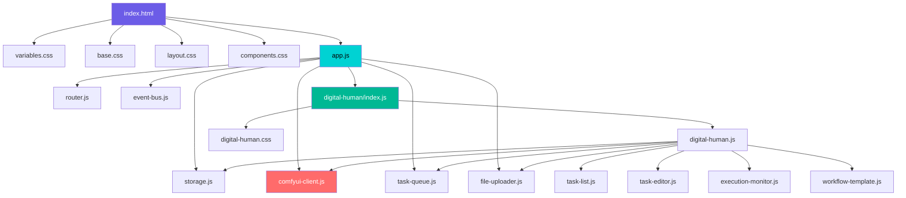

# CreatorFlow — 完整需求与实现计划

> **项目定位**：通用 AI 内容创作平台，首期交付"数字人批量生成"模块  
> **技术方案**：纯前端 SPA，直连 ComfyUI API（`http://127.0.0.1:8188`）  
> **平台名称**：CreatorFlow

---

## 一、项目概述

### 1.1 愿景

CreatorFlow 是一个模块化的 AI 内容创作平台，通过统一的可视化界面调度 ComfyUI 工作流，实现批量化、自动化的内容生产。平台采用插件式模块架构，首期聚焦数字人视频批量生成，未来可扩展图片生成、音频处理、视频编辑等模块。

### 1.2 首期目标（MVP）

用户可以在 CreatorFlow 中：
1. 批量创建数字人生成任务（上传参考图 + 音频 + 编写提示词）
2. 一键启动队列，自动逐个提交到 ComfyUI 后台执行
3. 实时查看每个任务的执行进度（采样步骤、当前节点）
4. 完成后在线预览视频、逐个下载结果
5. 任务配置持久化，刷新页面不丢失

### 1.3 非目标（MVP 不做）

- ❌ 用户登录 / 多用户
- ❌ 模板系统
- ❌ 音频自动分段
- ❌ 视频批量打包下载
- ❌ 其他模块（图生图等）

---

## 二、功能需求

### 2.1 平台框架（Platform Shell）

#### F-001：平台布局
- 左侧固定侧边栏导航（可折叠）
- 右侧为模块内容区（占满剩余空间）
- 底部全局状态栏

#### F-002：侧边栏导航
- 显示平台 Logo + 名称 "CreatorFlow"
- 导航项列表：每个模块一个图标+名称
- 首期只有一项："👤 数字人生成"
- 底部固定 "⚙ 设置" 入口
- 当前激活项高亮
- 支持折叠（仅显示图标）

#### F-003：全局状态栏
- ComfyUI 连接状态指示（🟢 已连接 / 🔴 断开 / 🟡 重连中）
- 当前全局队列概况（如 "执行中 2/10"）
- ComfyUI 服务地址显示

#### F-004：设置面板
- ComfyUI 服务器地址配置（默认 `http://127.0.0.1:8188`）
- 连接测试按钮
- 侧边栏折叠/展开偏好
- 所有设置保存到 localStorage

#### F-005：路由系统
- 基于 URL hash 的简易路由
- `#/digital-human` → 数字人模块
- `#/settings` → 设置面板
- 默认路由 → 数字人模块（首期只有它）

---

### 2.2 数字人生成模块（Digital Human Module）

#### F-100：模块整体布局

```
┌──────────────────────────────────────────────────────┐
│  模块头部：标题 "数字人批量生成" + 操作按钮区            │
├─────────────────┬────────────────────────────────────┤
│                 │                                    │
│   📋 任务列表    │        📝 任务编辑 / 执行监控         │
│   （左面板）     │           （右面板）                  │
│                 │                                    │
│   240px 固定宽   │          自适应剩余空间               │
│                 │                                    │
├─────────────────┴────────────────────────────────────┤
│  操作栏：▶ 开始执行 │ ⏸ 暂停 │ 进度汇总               │
└──────────────────────────────────────────────────────┘
```

右面板有两种状态：
- **编辑态**：选中任务时，显示任务编辑器
- **执行态**：队列运行中时，显示执行监控面板

---

#### F-101：任务创建

**输入项：**

| 字段 | 类型 | 必填 | 说明 |
|------|------|------|------|
| 任务名称 | 文本 | ❌ | 自动生成如 "任务 001"，用户可修改 |
| 参考图 | 图片文件 | ✅ | 支持 jpg/jpeg/png/webp，正面照效果最佳 |
| 音频 | 音频文件 | ✅ | 支持 mp3/wav/flac/ogg |
| 提示词 | 多行文本 | ✅ | 描述画面内容，如 "一位年轻女人面向镜头说话" |
| 随机种子 | 整数 | ❌ | 默认 42，-1 表示随机 |
| 生成时长 | 整数(秒) | ❌ | 默认 6，范围 1-35 |
| 帧率 | 浮点 | ❌ | 默认 30 |
| 最大分辨率 | 整数 | ❌ | 默认 1280 |

**交互行为：**
- 点击 [+ 新增任务] 按钮创建新任务
- 创建后自动选中并在右面板打开编辑器
- 高级参数（种子/时长/帧率/分辨率）默认折叠，展开可编辑

#### F-102：文件上传

**参考图上传：**
- 方式 1：点击上传区域选择文件
- 方式 2：拖拽文件到上传区域
- 上传后显示图片缩略图预览（140×140 区域，保持比例）
- 支持重新上传替换
- 显示文件名和文件大小

**音频上传：**
- 方式 1：点击上传区域选择文件
- 方式 2：拖拽文件到上传区域
- 上传后显示音频文件信息（文件名、时长、格式）
- 内嵌 `<audio>` 播放器，可试听
- 支持重新上传替换

> **注意：此处的"上传"是上传到前端界面暂存。实际上传到 ComfyUI 在任务执行时才进行。**

#### F-103：任务列表

- 垂直列表排列，每项显示：
  - 勾选框（checkbox）
  - 任务缩略图（参考图的小图标，32×32）
  - 任务名称
  - 状态标签（待执行 / 上传中 / 执行中 / 已完成 / 失败）
- 操作：
  - 单击选中 → 右面板显示编辑器
  - 拖拽排序（改变执行顺序）
  - 右键菜单 / 操作按钮：复制任务、删除任务
- 顶部工具栏：
  - [+ 新增任务]
  - [全选 / 取消全选]
  - [删除已选]
- 底部统计：共 N 项，已选 M 项

#### F-104：任务编辑器（右面板 - 编辑态）

当选中某个任务且队列未运行时，右面板显示编辑器：
- 任务名称（可编辑文本框）
- 参考图上传区（大预览 + 上传/替换按钮）
- 音频上传区（播放器 + 上传/替换按钮）
- 提示词文本框（多行，支持换行）
- 高级设置（折叠面板）：
  - 随机种子输入框 + "🎲随机" 按钮
  - 生成时长滑块 + 数值输入（1-35s）
  - 帧率输入（默认 30）
  - 最大分辨率下拉选择（768 / 1024 / 1280）
- 所有修改实时保存（无需"保存"按钮）

#### F-105：批量快捷操作

- **批量导入图片**：拖入多张图片到任务列表区域 → 自动为每张图创建一个新任务（音频和提示词待填）
- **复制任务**：基于已有任务创建副本，保留提示词和高级参数，仅清空图片和音频

#### F-106：队列执行控制

**操作按钮：**
- ▶ **开始执行**：从队列中第一个"待执行"且已勾选的任务开始
- ⏸ **暂停**：当前任务执行完毕后暂停（不中断正在采样的任务）
- ⏹ **停止**：尝试中断当前任务（调用 ComfyUI 取消 API）并停止队列
- 🔄 **重试失败**：将所有"失败"状态的任务重置为"待执行"

**执行前校验：**
- 检查 ComfyUI 是否已连接
- 检查已勾选的任务是否都填完了必填项（参考图、音频、提示词）
- 校验不通过的任务标记红色警告，不阻止其他任务执行

**执行逻辑（按顺序逐个执行）：**
```
对于每个已勾选的待执行任务:
  1. 状态 → "上传中"
  2. 将参考图通过 POST /upload/image 上传到 ComfyUI
  3. 将音频通过 POST /upload/image 上传到 ComfyUI
  4. 构建 workflow JSON（替换节点参数）
  5. 状态 → "执行中"
  6. POST /prompt 提交工作流
  7. 通过 WebSocket 监听执行进度
  8. 执行完成 → GET /history/{promptId} 获取输出文件
  9. 状态 → "已完成"（记录输出视频路径）
  
  如果任何步骤出错:
  9. 状态 → "失败"（记录错误信息）
  10. 继续下一个任务
```

#### F-107：执行监控面板（右面板 - 执行态）

队列运行中时，右面板切换为监控视图：

- **当前任务详情：**
  - 任务名称 + 参考图缩略图
  - 当前阶段：上传中 → 执行中（节点 xxx）→ 完成
  - 采样进度条：步骤 3/8 → 37.5%（实时更新）
  - 预计剩余时间（基于历史耗时估算）

- **全局队列进度：**
  - 所有任务的状态列表（紧凑版）
  - 每个任务一行：缩略图 + 名称 + 进度条 + 状态图标
  - 已完成的任务可直接点击预览视频

- **实时日志（可选折叠）：**
  - WebSocket 收到的消息流
  - 当前执行的节点名称

#### F-108：结果预览与下载

- 任务完成后，点击该任务可以：
  - 在右面板内嵌视频播放器播放生成的视频
  - 点击 [下载] 按钮保存视频到本地
- 视频通过 ComfyUI 的 `/view?filename=xxx&type=output` 接口获取
- 已完成任务的列表项上显示一个播放小图标

#### F-109：数据持久化

- 所有任务元数据保存到 localStorage
  - 任务 ID、名称、提示词、高级参数、状态、输出文件路径
  - 文件引用（文件名，非二进制数据本身）
- 刷新页面后恢复任务列表
- 注意：已上传到前端但未提交到 ComfyUI 的文件，刷新后需要重新上传
  - 解决方案：用 IndexedDB 缓存已选择的文件 Blob
  - 或者：创建任务时就立即上传到 ComfyUI，而非执行时才上传

### 🔑 决策点：文件何时上传到 ComfyUI？

| 方案 | 描述 | 优点 | 缺点 |
|------|------|------|------|
| A. 执行时上传 | 点"开始执行"后，逐个上传 | 不会上传无用文件 | 刷新后文件丢失需重选 |
| B. 选择时立即上传 | 用户选择文件后立即传到 ComfyUI | 刷新不丢失（文件已在服务器） | 可能上传了不需要的文件 |

> **推荐方案 B**：选择文件后立即上传到 ComfyUI input 目录。这样 localStorage 只需保存文件名即可完整恢复状态。用户体验更好。

---

## 三、非功能需求

### 3.1 性能

| 指标 | 目标 |
|------|------|
| 首屏加载 | < 1 秒（纯静态文件，无打包依赖） |
| 任务列表渲染 | 100 个任务列表滚动流畅 |
| WebSocket 消息处理 | 不阻塞 UI 渲染 |

### 3.2 兼容性

- 浏览器：Chrome 90+（主要目标）、Edge 90+
- 不考虑移动端（桌面本地工具）
- 屏幕分辨率：最小 1280×720

### 3.3 容错

- ComfyUI 断线自动重连（指数退避，最大 30 秒间隔）
- 单个任务执行失败不影响后续任务
- 上传失败自动重试 2 次
- 所有异步操作有超时处理（上传 60s、执行 600s）

### 3.4 可维护性

- 代码模块化：`core/` 与 `modules/` 职责清晰分离
- CSS 变量驱动的设计系统，一处改色全局生效
- 关键操作有 console.log 日志

---

## 四、UI 设计规范

### 4.1 视觉风格

- **主题**：暗色主题（深蓝黑底色）
- **调性**：专业、科技感、沉浸式
- **配色方案**：

| 用途 | 色值 | 说明 |
|------|------|------|
| 主色 | `#6C5CE7` | 优雅紫，用于主按钮、高亮、选中态 |
| 主色浅 | `#A29BFE` | 悬停态、辅助指示 |
| 强调色 | `#00D2D3` | 赛博青，用于进度条、成功状态、重点数据 |
| 背景主 | `#0F0F1A` | 页面底色 |
| 背景次 | `#1A1A2E` | 侧边栏、面板区 |
| 背景卡片 | `#16213E` | 卡片、弹窗 |
| 玻璃层 | `rgba(255,255,255,0.05)` | 毛玻璃效果层 |
| 成功 | `#00B894` | 完成状态 |
| 警告 | `#FDCB6E` | 校验提示 |
| 错误 | `#FF6B6B` | 失败状态 |
| 主文字 | `#E8E8F0` | 正文 |
| 次文字 | `#9898B0` | 辅助说明 |

- **字体**：`Inter`（英文）+ `Noto Sans SC`（中文），通过 Google Fonts 引入
- **图标**：内联 SVG，线条风格

### 4.2 组件规范

#### 按钮
- 主按钮：紫色填充，圆角 8px，悬停加亮 + 发光阴影
- 次按钮：透明底 + 紫色边框，悬停填充半透明
- 危险按钮：红色系，仅在删除操作使用
- 禁用态：0.5 透明度 + 禁止光标

#### 卡片
- 背景 `var(--bg-tertiary)`
- 圆角 12px
- 1px 边框 `rgba(255,255,255,0.08)`
- 悬停边框亮度提升

#### 上传区域
- 虚线边框（`dashed`），悬停变实线
- 拖拽进入时高亮（紫色边框 + 背景变亮）
- 中心显示上传图标 + 文字提示

#### 进度条
- 高度 6px，圆角全圆
- 背景 `rgba(255,255,255,0.1)`
- 填充渐变 `linear-gradient(90deg, #6C5CE7, #00D2D3)`
- 附带百分比文字

#### 状态标签
- 小圆角胶囊形状
- 不同状态不同颜色：
  - 待执行：灰色
  - 上传中：蓝色
  - 执行中：紫色 + 脉冲动画
  - 已完成：绿色
  - 失败：红色

### 4.3 动画与过渡

| 场景 | 动画 |
|------|------|
| 页面切换 | 内容区 fade + translateY(10px) 进入 |
| 任务卡片添加 | slideDown + fadeIn |
| 任务卡片删除 | slideUp + fadeOut |
| 状态变化 | 颜色 transition 300ms |
| 进度条更新 | width transition 150ms |
| 侧边栏折叠 | width transition 300ms |
| 按钮悬停 | transform scale(1.02) + 发光阴影 |
| 上传拖拽进入 | 边框颜色 + 背景亮度变化 |
| 执行中状态 | 脉冲呼吸发光动画 |

---

## 五、技术设计

### 5.1 项目目录结构

```
f:\codePro\AIPro\comfyUI-workflow\
├── ltx2.3数字人工作流-api.json           # 原始工作流（保留不动）
├── ltx2.3数字人工作流.json               # 全量工作流（保留不动）
└── creatorflow/                          # CreatorFlow 项目目录
    ├── index.html                        # 入口 HTML
    ├── styles/
    │   ├── variables.css                 # 设计令牌
    │   ├── base.css                      # 全局基础样式
    │   ├── layout.css                    # 平台布局
    │   └── components.css                # 通用组件样式
    ├── core/
    │   ├── app.js                        # 应用初始化 + 模块注册
    │   ├── router.js                     # Hash 路由
    │   ├── comfyui-client.js             # ComfyUI API 客户端
    │   ├── file-uploader.js              # 文件上传服务
    │   ├── task-queue.js                 # 任务队列引擎
    │   ├── storage.js                    # 持久化封装
    │   └── event-bus.js                  # 发布/订阅事件总线
    ├── modules/
    │   └── digital-human/
    │       ├── index.js                  # 模块注册
    │       ├── digital-human.js          # 主控制器
    │       ├── digital-human.css         # 模块样式
    │       ├── task-editor.js            # 任务编辑器
    │       ├── task-list.js              # 任务列表
    │       ├── execution-monitor.js      # 执行监控
    │       └── workflow-template.js      # 工作流模板 + 参数替换逻辑
    └── assets/
        └── logo.svg                      # 平台 Logo
```

### 5.2 核心模块 API 设计

#### `core/comfyui-client.js`

```javascript
class ComfyUIClient {
  constructor(baseUrl)

  // 连接
  async connect()                              → void
  disconnect()                                 → void
  get isConnected()                            → boolean
  get connectionState()                        → 'connected'|'disconnected'|'reconnecting'
  onConnectionChange(callback)                 → unsubscribe fn

  // 文件上传
  async uploadImage(file, filename?)           → { name, subfolder, type }
  async uploadAudio(file, filename?)           → { name, subfolder, type }

  // 工作流执行
  async submitPrompt(workflow)                 → { prompt_id }
  async getHistory(promptId)                   → object
  async getQueue()                             → { queue_running, queue_pending }
  async cancelCurrent()                        → void

  // 进度监听（基于 WebSocket）
  onProgress(callback)                         → unsubscribe fn
  onExecuting(callback)                        → unsubscribe fn
  onExecuted(callback)                         → unsubscribe fn
  onExecutionComplete(callback)                → unsubscribe fn
  onExecutionError(callback)                   → unsubscribe fn

  // 文件访问
  getViewUrl(filename, subfolder, type)        → string (URL)
}
```

#### `core/task-queue.js`

```javascript
class TaskQueue {
  constructor(comfyClient)

  // 队列管理
  addTask(task)                                → taskId
  removeTask(taskId)                           → void
  reorderTasks(taskIds[])                      → void
  getTask(taskId)                              → task
  getAllTasks()                                 → task[]
  getSelectedTasks()                           → task[]

  // 执行控制
  async start()                                → void
  pause()                                      → void
  stop()                                       → void
  async retryFailed()                          → void
  get isRunning()                              → boolean

  // 事件
  onTaskStatusChange(callback)                 → unsubscribe fn
  onTaskProgress(callback)                     → unsubscribe fn
  onQueueComplete(callback)                    → unsubscribe fn

  // 持久化
  saveState()                                  → void
  loadState()                                  → void
}
```

#### `core/router.js`

```javascript
class Router {
  register(path, handler)                      → void
  navigate(path)                               → void
  getCurrentPath()                             → string
  start()                                      → void  // 开始监听 hashchange
}
```

#### `core/event-bus.js`

```javascript
class EventBus {
  on(event, callback)                          → unsubscribe fn
  emit(event, data)                            → void
  off(event, callback)                         → void
}
```

#### `core/storage.js`

```javascript
class Storage {
  get(key, defaultValue?)                      → any
  set(key, value)                              → void
  remove(key)                                  → void
  clear()                                      → void
}
```

### 5.3 数字人模块内部设计

#### 数据模型

```javascript
// 单个任务
const Task = {
  id: 'task_001',                    // 唯一标识
  name: '任务 001',                   // 用户可编辑名称
  selected: true,                    // 是否勾选参与执行
  
  // 输入
  image: {
    file: File | null,               // 浏览器 File 对象（刷新后丢失）
    uploadedName: 'task_001_ref.jpg', // 上传到 ComfyUI 后的文件名
    previewUrl: 'blob:...',          // 本地预览 URL
    originalName: '我的照片.jpg',     // 原始文件名
    size: 1024000,                   // 字节数
  },
  audio: {
    file: File | null,
    uploadedName: 'task_001_audio.mp3',
    previewUrl: 'blob:...',
    originalName: '语音.mp3',
    size: 2048000,
    duration: 12.5,                  // 秒
  },
  prompt: '一位年轻的中国女人面向镜头自信的说话。',
  
  // 高级参数
  seed: 42,
  duration: 6,                       // 生成秒数
  fps: 30,
  maxResolution: 1280,
  
  // 执行状态
  status: 'pending',                 // pending|uploading|running|completed|failed
  promptId: null,                    // ComfyUI 返回的 prompt_id
  progress: 0,                       // 0-1 采样进度
  currentNode: null,                 // 当前执行节点名
  error: null,                       // 错误信息
  
  // 输出
  output: {
    videoUrl: null,                  // ComfyUI /view URL
    filename: null,                  // 输出文件名
    subfolder: null,
    type: null,
  },
  
  // 时间戳
  createdAt: '2026-04-17T11:30:00Z',
  startedAt: null,
  completedAt: null,
};
```

#### 工作流参数映射

```javascript
// modules/digital-human/workflow-template.js

// 节点 ID 到参数的映射关系（来自 API 工作流分析）
const NODE_MAP = {
  IMAGE:          { nodeId: '444',  field: 'image' },           // LoadImage
  AUDIO:          { nodeId: '1594', field: 'audio' },           // LoadAudio
  PROMPT:         { nodeId: '1624', field: 'value' },           // 提示词
  SEED:           { nodeId: '1527', field: 'value' },           // 随机种子
  DURATION:       { nodeId: '1583', field: 'value' },           // 生成秒数
  FPS:            { nodeId: '1586', field: 'value' },           // 帧率
  MAX_RESOLUTION: { nodeId: '1606', field: 'value' },           // 最大分辨率
  OUTPUT:         { nodeId: '1747' },                           // 输出节点 (VHS_VideoCombine)
};

function buildWorkflow(template, task) {
  const wf = structuredClone(template);
  
  wf[NODE_MAP.IMAGE.nodeId].inputs[NODE_MAP.IMAGE.field] = task.image.uploadedName;
  wf[NODE_MAP.AUDIO.nodeId].inputs[NODE_MAP.AUDIO.field] = task.audio.uploadedName;
  wf[NODE_MAP.PROMPT.nodeId].inputs[NODE_MAP.PROMPT.field] = task.prompt;
  wf[NODE_MAP.SEED.nodeId].inputs[NODE_MAP.SEED.field] = task.seed;
  wf[NODE_MAP.DURATION.nodeId].inputs[NODE_MAP.DURATION.field] = task.duration;
  wf[NODE_MAP.FPS.nodeId].inputs[NODE_MAP.FPS.field] = task.fps;
  wf[NODE_MAP.MAX_RESOLUTION.nodeId].inputs[NODE_MAP.MAX_RESOLUTION.field] = task.maxResolution;
  
  return wf;
}
```

### 5.4 WebSocket 消息处理

ComfyUI WebSocket 推送的消息类型及处理策略：

| 消息类型 | 数据 | 处理 |
|----------|------|------|
| `status` | `{status: {exec_info: {queue_remaining}}}` | 更新全局队列数 |
| `execution_start` | `{prompt_id}` | 标记任务开始执行 |
| `executing` | `{node: "444"}` | 更新当前执行节点名（通过 _meta.title 映射中文名） |
| `progress` | `{value: 3, max: 8, prompt_id}` | 更新采样进度 3/8 → 37.5% |
| `executed` | `{node, output, prompt_id}` | 某节点执行完成（可获取中间输出） |
| `execution_complete` | `{prompt_id}` | 整个工作流完成 → 获取结果 |
| `execution_error` | `{prompt_id, ...error}` | 执行出错 → 标记失败 |
| `execution_cached` | `{nodes: [...]}` | 部分节点使用缓存（跳过） |

### 5.5 错误处理策略

| 错误场景 | 处理方式 |
|----------|----------|
| ComfyUI 未启动 / 连接失败 | 状态栏显示 🔴，禁用执行按钮，5s 后自动重试连接 |
| 文件上传失败 | 重试 2 次，仍失败则标记任务为 failed，记录错误信息 |
| 工作流提交失败 | 标记任务 failed，继续下一个任务 |
| 执行超时（>600s） | 标记任务 failed，尝试 cancel |
| WebSocket 断线 | 指数退避重连，正在执行的任务通过轮询 /queue 和 /history 补偿 |
| 节点执行出错 | 记录 ComfyUI 返回的错误详情，显示在任务详情中 |

---

## 六、实现计划

### Phase 1：平台骨架（预计 1 小时）

| 步骤 | 内容 | 产出文件 |
|------|------|----------|
| 1.1 | 创建项目目录结构 | 目录 |
| 1.2 | 编写 `index.html` 主骨架 | index.html |
| 1.3 | 实现设计令牌 + 基础样式 | variables.css, base.css |
| 1.4 | 实现平台布局（侧边栏 + 内容区 + 状态栏） | layout.css |
| 1.5 | 实现通用组件样式（按钮、卡片、输入框） | components.css |
| 1.6 | 实现路由系统 | router.js |
| 1.7 | 实现事件总线 | event-bus.js |
| 1.8 | 实现存储服务 | storage.js |
| 1.9 | 实现 App 初始化 + 侧边栏交互 | app.js |

**Phase 1 验收标准**：打开 index.html 可以看到完整的平台布局、侧边栏可折叠、路由切换正常。

### Phase 2：ComfyUI 核心服务（预计 0.5 小时）

| 步骤 | 内容 | 产出文件 |
|------|------|----------|
| 2.1 | 实现 ComfyUI REST API 封装 | comfyui-client.js |
| 2.2 | 实现 WebSocket 连接 + 自动重连 | comfyui-client.js |
| 2.3 | 实现文件上传服务 | file-uploader.js |
| 2.4 | 实现任务队列引擎 | task-queue.js |
| 2.5 | 状态栏接入连接状态显示 | app.js 更新 |

**Phase 2 验收标准**：状态栏实时显示 ComfyUI 连接状态，可以通过 console 手动调用上传/提交 API。

### Phase 3：数字人模块 UI（预计 1.5 小时）

| 步骤 | 内容 | 产出文件 |
|------|------|----------|
| 3.1 | 模块注册 + 基础框架 | digital-human/index.js |
| 3.2 | 任务列表组件 | task-list.js, digital-human.css |
| 3.3 | 任务编辑器组件 | task-editor.js |
| 3.4 | 文件上传交互（拖拽 + 预览） | task-editor.js |
| 3.5 | 执行控制栏 | digital-human.js |
| 3.6 | 执行监控面板 | execution-monitor.js |
| 3.7 | 结果预览 + 下载 | execution-monitor.js |

**Phase 3 验收标准**：界面完整可操作——可以添加任务、上传文件、编辑参数、看到任务列表。

### Phase 4：端到端联调（预计 0.5 小时）

| 步骤 | 内容 |
|------|------|
| 4.1 | 工作流模板集成 + 参数替换逻辑 |
| 4.2 | 完整执行流程打通：上传 → 提交 → 进度 → 完成 |
| 4.3 | 多任务队列执行测试 |
| 4.4 | 错误场景测试（断线、上传失败、执行失败） |
| 4.5 | localStorage 持久化验证 |

**Phase 4 验收标准**：从界面创建 2 个任务 → 点击执行 → 自动逐个提交 ComfyUI → 实时看到进度 → 完成后可预览视频。

### Phase 5：UI 打磨（预计 0.5 小时）

| 步骤 | 内容 |
|------|------|
| 5.1 | 动画与过渡效果 |
| 5.2 | 空状态设计（无任务时的引导页） |
| 5.3 | 响应式适配（最小 1280px 宽度优化） |
| 5.4 | 全局 loading / toast 通知组件 |
| 5.5 | 键盘快捷键（Delete 删除、Ctrl+N 新建等） |

---

## 七、文件依赖关系



---

## 八、验收清单

### 核心功能验收

- [ ] 打开 index.html，平台布局正确（侧边栏 + 内容区 + 状态栏）
- [ ] 侧边栏可折叠/展开，动画流畅
- [ ] ComfyUI 连接状态实时显示
- [ ] 可设置 ComfyUI 服务器地址
- [ ] 创建新任务，默认编号自增
- [ ] 上传参考图，显示缩略图预览
- [ ] 上传音频文件，可试听播放
- [ ] 编辑提示词
- [ ] 编辑高级参数（种子/时长/帧率/分辨率）
- [ ] 任务列表勾选/取消
- [ ] 任务列表拖拽排序
- [ ] 复制任务
- [ ] 删除任务
- [ ] 点击"开始执行"，校验必填项
- [ ] 逐个任务执行，实时显示采样进度
- [ ] 任务完成后可在线预览视频
- [ ] 任务完成后可下载视频
- [ ] 某个任务失败，不影响后续任务
- [ ] 失败任务可重试
- [ ] 刷新页面，任务列表恢复

### 视觉验收

- [ ] 暗色主题、配色统一
- [ ] 按钮悬停有发光效果
- [ ] 进度条渐变色，平滑过渡
- [ ] 状态标签颜色区分明确
- [ ] 执行中状态有脉冲动画
- [ ] 卡片有微妙的玻璃拟态效果
- [ ] 空状态有引导提示

---

> **以上为 CreatorFlow v1.0 的完整需求与实现计划。确认后即开始 Phase 1 编码。**
