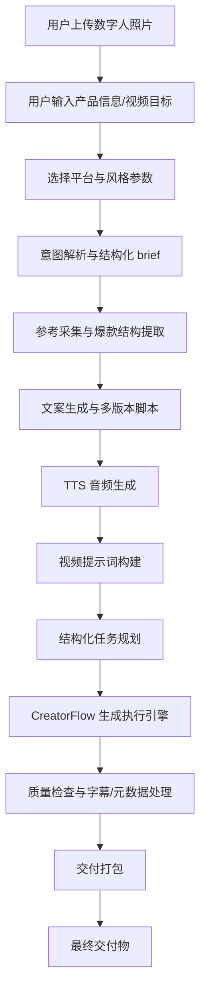
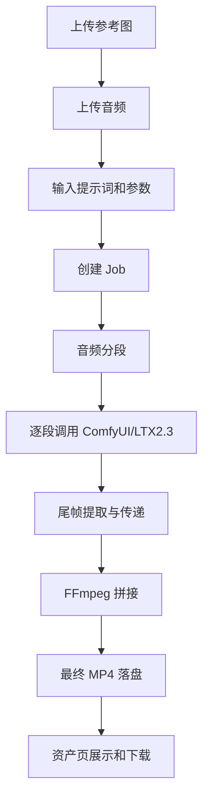

# CreatorFlow 本地数字人口播视频产品需求方案

## 1. 文档信息

- 产品名称：CreatorFlow 本地数字人口播视频生成工作台
- 文档类型：产品级完整需求方案
- 版本：v1.0
- 日期：2026-05-09
- 项目级别：T2+ 本地多模块生产工具
- 适用范围：基于当前 CreatorFlow 项目，面向架构图中的完整本地化数字人口播视频产品能力
- 关联基线：
  - `docs/requirements/digital-human-segmented-batch/PRD.md`
  - `docs/requirements/digital-human-segmented-batch/technical-design.md`
  - `docs/contract/api-contract.md`
  - `docs/contract/state-machine.md`

## 2. 产品定位

CreatorFlow 的目标不是成为通用内容平台，而是成为一个面向单机创作者和运营人员的本地数字人口播视频生产工作台。

系统从用户照片、产品信息、视频目标和平台风格参数出发，自动或半自动完成爆款参考分析、口播文案生成、TTS 音频生成、ComfyUI/LTX2.3 数字人口播视频分段生成、最终拼接、字幕/标题/简介/封面等交付物组织，并在本地完成存储、追踪、重试和交付。

当前项目已经具备本地前端、FastAPI 编排服务、SQLite、ComfyUI 工作流对接、音频分段、尾帧衔接、FFmpeg 拼接等基础能力。本需求方案将现有能力向架构图中的完整产品形态扩展。

## 3. 当前完成度基线

### 3.1 已具备能力

| 能力域 | 当前状态 | 说明 |
|---|---|---|
| 前端工作台 | 已有雏形 | 具备任务列表、任务编辑、执行监控、设置、资产页 |
| 本地编排服务 | 已有实现 | FastAPI + SQLite + Job/Segment/Artifact 模型 |
| ComfyUI 对接 | 已有实现 | 可构建 LTX2.3 工作流并提交 prompt |
| 长音频分段 | 已有实现 | 基于 ffprobe/ffmpeg silencedetect 生成分段计划 |
| 尾帧衔接 | 已有实现 | 后续分段可使用上一段尾帧作为参考图 |
| 视频拼接 | 已有实现 | 使用本地 FFmpeg concat，支持失败回退重编码 |
| 清理调度 | 已有实现 | 已有 artifact 清理策略和延迟清理任务 |
| 文档基线 | 已较完整 | v2.1 PRD、技术设计、API 合同、状态机、任务拆解已存在 |

### 3.2 主要缺口

| 缺口 | 影响 | 优先级 |
|---|---|---|
| 最终 MP4 交付闭环未稳定证明 | 无法确认当前链路稳定可验收 | P0 |
| 取消、失败恢复、从失败分段重试不完整 | 长任务失败后用户成本高 | P0 |
| 前端刷新后未完全从后端恢复任务真相 | 页面状态与后台任务可能脱节 | P0 |
| 内容生产 Agent 层缺失 | 仍依赖用户手写脚本/prompt/音频 | P1 |
| TTS 生成缺失 | 无法从文案直接进入口播音频生产 | P1 |
| 质检、字幕、封面、标题简介、交付包缺失 | 最终交付物不完整 | P1 |
| 爆款参考采集与结构提取缺失 | 缺少平台化内容策略能力 | P2 |

## 4. 产品目标

### 4.1 业务目标

1. 用户可以在本地从一张数字人参考图和一段需求输入开始，生成可交付的口播视频成品。
2. 用户可以选择保守的半自动模式：AI 生成文案、提示词、音频和执行计划后，由用户确认再生成视频。
3. 用户可以批量生成多个版本，比较不同脚本、提示词、语气、平台参数下的视频结果。
4. 系统必须把中间产物、最终产物、日志和可追溯记录落到本地，而不是只依赖浏览器内存。
5. 当前 MVP 的核心生成链路要先稳定，再逐步扩展内容 Agent 和交付层能力。

### 4.2 产品目标

1. 将 CreatorFlow 从“ComfyUI 工作流包装器”升级为“本地口播视频生产工作台”。
2. 形成用户可理解的产品流程：输入需求 -> 生成方案 -> 审核脚本/音频 -> 执行生成 -> 质检交付。
3. 保持本地优先：用户素材、音频、视频、数据库和日志默认保留在本机。
4. 保持可控优先：AI 生成内容必须可编辑、可重跑、可追踪，不默认覆盖用户确认过的版本。
5. 保持当前数字人批量生成 MVP 边界，不提前扩展为多用户 SaaS 或云端协作平台。

## 5. 非目标

本阶段不做以下内容：

1. 不做多用户账号、权限、云端团队协作。
2. 不做实时直播、实时互动数字人。
3. 不做跨机器分布式 GPU 调度。
4. 不做自动发布到抖音、TikTok、YouTube Shorts 等平台。
5. 不做商品交易、订单系统、支付系统。
6. 不承诺完全自动化爆款，系统只提供结构化辅助和本地生成能力。
7. 不替代专业剪辑工具，不提供复杂时间线、多轨剪辑、手动逐帧修复。
8. 不在未明确配置的情况下把用户素材上传到外部服务。

## 6. 目标用户与场景

### 6.1 目标用户

| 用户类型 | 特征 | 核心诉求 |
|---|---|---|
| 本地 ComfyUI 创作者 | 已有模型、节点、显卡环境 | 降低手动工作流操作和重复排队成本 |
| 短视频运营人员 | 熟悉产品卖点但不熟悉 ComfyUI | 快速产出口播视频和多版本文案 |
| 独立创作者/小团队 | 需要控制素材隐私和成本 | 本地批量生成、可追踪、可重试 |
| AI 视频实验用户 | 关注风格、提示词和参数 | 便于迭代脚本、提示词、音频和结果 |

### 6.2 核心场景

#### 场景 A：手动素材输入生成口播视频

用户上传数字人参考图、上传已有配音音频、输入提示词和参数，系统分段生成、尾帧衔接、拼接并导出 MP4。

这是当前 v2.1 MVP 的核心场景，必须最先稳定。

#### 场景 B：从产品信息生成脚本和音频

用户输入产品名称、卖点、目标用户、平台和口播目标，系统生成多版本脚本，用户选择后生成 TTS 音频，再进入视频生成。

#### 场景 C：根据平台风格生成多版本短视频

用户选择抖音/TikTok/YouTube Shorts 等平台参数，系统生成不同语气、节奏、标题、简介和 CTA 的版本，用户批量生成并比较。

#### 场景 D：失败恢复与重新生成

某一分段生成失败、ComfyUI 断开、FFmpeg 拼接失败或页面刷新后，系统必须保留已完成结果，允许用户从失败位置重试。

#### 场景 E：交付包整理

任务完成后，系统输出成片 MP4、字幕 SRT、标题简介、封面图、脚本版本、执行日志和可追溯记录，用户可以按任务导出。

## 7. 产品边界与阶段

### 7.1 阶段划分

| 阶段 | 名称 | 目标 | 交付判断 |
|---|---|---|---|
| R0 | 当前 MVP 闭环修复 | 稳定照片+音频+prompt 到最终 MP4 | 25-30s 音频可完整生成并落盘 |
| R1 | 产品工作台成型 | 项目/任务/资产/设置/监控/结果管理完整 | 用户可从前端完成全流程 |
| R2 | 内容 Agent 最小闭环 | 需求输入 -> 文案 -> TTS -> 提示词 -> 执行计划 | 可由产品信息生成可执行任务 |
| R3 | 交付物增强 | 字幕、标题简介、封面、版本管理、交付包 | 输出完整交付物集合 |
| R4 | 参考分析增强 | 爆款参考采集、结构提取、风格模板 | 可基于参考生成脚本策略 |

### 7.2 MVP 边界

完整产品可以包含 Agent 和交付层，但近期 MVP 必须只承诺：

1. 照片、音频、提示词、平台参数输入。
2. 长音频自动分段，单段 UI 可见时长保持 `1-10s`，默认 `6s` 或 `8s` 由具体模块约定。
3. 分段串行生成，避免显存冲突。
4. 尾帧衔接。
5. 最终 MP4 自动拼接和本地落盘。
6. 页面刷新后可从后端恢复任务、分段、最终结果。
7. 失败可重试，至少支持从失败分段继续。
8. 任务日志和产物可追溯。

## 8. 总体业务流程

### 8.1 完整产品流程

### 8.2 当前优先流程

## 9. 功能需求总览

优先级定义：

- P0：当前 MVP 必须完成，阻塞可交付。
- P1：完整产品第一阶段必须完成。
- P2：增强体验和效率，不阻塞基础交付。
- P3：长期能力。

### 9.1 用户接入层

| ID | 需求 | 优先级 |
|---|---|---|
| UA-001 | 支持用户上传数字人参考图，格式至少包含 jpg/jpeg/png/webp | P0 |
| UA-002 | 支持用户上传已有口播音频，格式至少包含 mp3/wav/ogg/flac | P0 |
| UA-003 | 支持输入产品信息、产品卖点、目标受众、视频目标 | P1 |
| UA-004 | 支持选择平台参数：抖音、TikTok、YouTube Shorts、通用短视频 | P1 |
| UA-005 | 支持选择风格参数：语气、节奏、时长、CTA 强度、受众表达方式 | P1 |
| UA-006 | 支持保存项目 brief，并允许后续再次生成新版本 | P1 |
| UA-007 | 支持从历史项目复用照片、品牌资料、风格参数 | P2 |

### 9.2 前端产品层

| ID | 需求 | 优先级 |
|---|---|---|
| FE-001 | 提供任务创建与配置界面 | P0 |
| FE-002 | 提供任务列表，支持选择、批量创建、删除、排序 | P0 |
| FE-003 | 提供执行进度监控，显示 Job/Segment 状态、当前节点、错误信息 | P0 |
| FE-004 | 提供结果预览和资产管理页，展示最终 MP4 | P0 |
| FE-005 | 提供本地编排服务、ComfyUI、输出目录、清理策略配置 | P0 |
| FE-006 | 页面刷新后从后端恢复任务状态，不以 localStorage 作为唯一真相源 | P0 |
| FE-007 | 支持任务版本管理：脚本版本、音频版本、视频结果版本 | P1 |
| FE-008 | 支持交付导出：单任务导出、批量导出、打开本地目录 | P1 |
| FE-009 | 支持对脚本、TTS、提示词、执行计划分步确认 | P1 |
| FE-010 | 支持对失败任务一键重试、从失败分段重试、复制为新任务 | P1 |

### 9.3 内容生产 Agent 层

| ID | 需求 | 优先级 |
|---|---|---|
| AG-001 | 意图解析器：将用户输入的产品信息、视频目标、平台参数结构化 | P1 |
| AG-002 | 参考采集器：接入外部参考数据源或用户导入的参考文本/链接 | P2 |
| AG-003 | 爆款结构提取器：从参考内容提取钩子、脚本结构、节奏、CTA、字幕风格 | P2 |
| AG-004 | 文案生成器：生成 1 个主脚本和多个变体脚本 | P1 |
| AG-005 | 文案编辑器：用户可修改、锁定、复制和废弃脚本版本 | P1 |
| AG-006 | TTS 音频生成服务：根据脚本、语速、情绪和音色生成音频 | P1 |
| AG-007 | 音频时长对齐：估算脚本时长，提示过长/过短，并可重写脚本 | P1 |
| AG-008 | 提示词构建器：把数字人形象、视频目标、脚本语气转换为 ComfyUI prompt | P1 |
| AG-009 | 任务规划器：输出结构化任务 JSON，包含 platform、script、segments、tts_config、video_prompt 等字段 | P1 |
| AG-010 | 支持用户在每个 Agent 输出后确认，未确认版本不进入生成执行 | P1 |

### 9.4 CreatorFlow 生成执行引擎层

| ID | 需求 | 优先级 |
|---|---|---|
| EX-001 | Job Manager：管理 Job 生命周期、状态流转、持久化 | P0 |
| EX-002 | Segment Planner：生成音频分段计划，优先按停顿点切分 | P0 |
| EX-003 | 单段最大生成时长硬上限为 `10s`，UI 可见控制保持 `1-10s` | P0 |
| EX-004 | Artifact Manager：登记输入、分段音频、分段视频、尾帧、最终视频 | P0 |
| EX-005 | Workflow Builder：基于模板克隆工作流，不直接污染原始模板 | P0 |
| EX-006 | 每个任务使用唯一 `filename_prefix`，避免多任务输出覆盖 | P0 |
| EX-007 | ComfyUI/LTX2.3 生成器：逐段上传素材、提交 prompt、等待执行结果 | P0 |
| EX-008 | 通过 `promptId -> taskId/jobId/segmentId` 映射隔离多任务进度 | P0 |
| EX-009 | Tail Frame Continuity：从上一段视频提取尾帧，作为下一段参考图 | P0 |
| EX-010 | FFmpeg Stitcher：拼接分段视频，优先无损 concat，失败后重编码 | P0 |
| EX-011 | Retry & Recovery：失败后保留已完成分段，从失败分段恢复 | P0 |
| EX-012 | Cancel：用户取消任务时应中断队列推进，并尽量中断 ComfyUI 当前执行 | P0 |
| EX-013 | 清理策略：保留原始输入和最终视频，按策略清理中间文件 | P0 |
| EX-014 | 支持 debug 模式保留中间产物，便于排查质量和拼接问题 | P0 |
| EX-015 | 支持单段模式，短音频不进入多段切分 | P0 |

### 9.5 质量控制与交付层

| ID | 需求 | 优先级 |
|---|---|---|
| QC-001 | Quality Inspector：检查最终 MP4 是否存在、可播放、时长非零 | P0 |
| QC-002 | 检查分段数量、分段时长、最终视频时长与音频时长偏差 | P1 |
| QC-003 | 检查黑帧、明显空白画面、拼接失败、缺音频等基础问题 | P1 |
| QC-004 | Subtitle Generator：基于脚本/TTS 输出字幕 SRT | P1 |
| QC-005 | Metadata Packager：生成标题、简介、标签、平台说明 | P1 |
| QC-006 | Cover Image：从视频或参考图生成/选择封面图 | P1 |
| QC-007 | Delivery Packager：按任务生成交付包目录或压缩包 | P1 |
| QC-008 | Result Output：在前端展示最终成片、路径、时长、尺寸、版本 | P0 |
| QC-009 | 交付物包括 MP4、SRT、标题简介、封面图、多版本脚本、任务日志 | P1 |
| QC-010 | 质检失败时标注失败项，不删除已生成结果 | P1 |

### 9.6 基础设施与部署层

| ID | 需求 | 优先级 |
|---|---|---|
| INF-001 | 本地 LLM 服务配置入口，用于脚本、提示词、结构化任务生成 | P1 |
| INF-002 | 本地或云端 TTS 服务配置入口 | P1 |
| INF-003 | ComfyUI 服务连接配置和健康检查 | P0 |
| INF-004 | FFmpeg/FFprobe 可用性检查 | P0 |
| INF-005 | 本地文件存储目录分区：work、output、delivery、logs | P0 |
| INF-006 | SQLite/元数据数据库保存项目、任务、分段、产物、日志 | P0 |
| INF-007 | 日志与监控：服务启动、任务生命周期、分段执行、错误栈、清理记录 | P0 |
| INF-008 | 模型管理与配置中心：保存工作流模板、节点映射、默认参数 | P1 |
| INF-009 | 一键启动和停止脚本必须能启动前端与编排服务 | P0 |
| INF-010 | ComfyUI 未启动时，系统可进入 degraded 状态并阻止生成任务启动 | P0 |

## 10. 数据需求

### 10.1 核心数据对象

| 对象 | 说明 | 持久化 |
|---|---|---|
| Project | 一个产品或视频生产项目 | 是 |
| ProductBrief | 产品信息、卖点、目标受众、视频目标 | 是 |
| PlatformProfile | 平台、风格、语气、时长、字幕偏好 | 是 |
| InputAsset | 用户上传照片、音频、资料文件 | 是 |
| ReferenceMaterial | 爆款参考、用户粘贴的参考文本/链接 | 是 |
| ScriptVersion | 文案版本、状态、用户确认记录 | 是 |
| TtsAudio | TTS 音频文件、音色、语速、情绪、时长 | 是 |
| VideoPrompt | 视频提示词版本和参数 | 是 |
| GenerationJob | 一次视频生成任务 | 是 |
| Segment | 任务内分段 | 是 |
| Artifact | 输入、中间产物、最终产物 | 是 |
| QualityReport | 质检结果 | 是 |
| DeliveryPackage | 交付包记录 | 是 |
| RuntimeConfig | 服务地址、输出目录、清理策略 | 是 |
| ExecutionLog | 任务生命周期和错误日志 | 是 |

### 10.2 输入数据

1. 数字人参考图：jpg/jpeg/png/webp。
2. 音频：mp3/wav/ogg/flac。
3. 产品资料：纯文本、Markdown、可选文档文件。
4. 平台参数：平台、语气、目标时长、受众、CTA。
5. 参考资料：URL、粘贴文本、手动导入视频/脚本摘要。
6. 运行配置：ComfyUI 地址、输出目录、清理延迟、debug 模式。

### 10.3 输出数据

1. 成片 MP4。
2. 字幕 SRT。
3. 标题与简介。
4. 封面图。
5. 多版本脚本文案。
6. TTS 音频。
7. 结构化任务 JSON。
8. 分段视频和尾帧等中间产物。
9. 质检报告。
10. 任务日志和可追溯记录。

### 10.4 不应持久化的数据

1. 浏览器 Blob URL。
2. DOM 状态和播放器实例。
3. 未经用户确认的临时预览结果，除非进入草稿版本。
4. 外部服务临时 token 明文。

## 11. 状态与版本需求

### 11.1 Project 状态

- `draft`：草稿。
- `ready`：已具备生成条件。
- `generating`：存在执行中任务。
- `completed`：至少一个交付包完成。
- `archived`：用户归档。

### 11.2 Script 状态

- `generated`：AI 生成。
- `edited`：用户编辑。
- `approved`：用户确认可用于生成。
- `rejected`：废弃。

### 11.3 Job 状态

沿用现有状态机：

- `draft`
- `queued`
- `preparing`
- `running`
- `concatenating`
- `completed`
- `failed`
- `cancelled`
- `cleaning`
- `partially_cleaned`

### 11.4 Segment 状态

沿用现有状态机：

- `pending`
- `splitting`
- `uploading`
- `submitted`
- `running`
- `extracting_tail_frame`
- `completed`
- `failed`
- `skipped`

### 11.5 版本规则

1. 脚本、TTS 音频、视频 prompt、执行任务、最终视频都必须有版本号。
2. 用户确认过的脚本版本不得被 AI 自动覆盖。
3. 重新生成视频时，默认创建新 Job，不覆盖旧 Job。
4. 删除最终视频前必须有用户确认；删除后需要同步清理数据库引用。

## 12. 非功能需求

### 12.1 本地优先与隐私

1. 默认所有文件保存在本地。
2. 用户素材不得默认上传到外部服务。
3. 如果使用云端 LLM/TTS，必须在设置中明确显示并由用户配置。
4. 日志不得记录完整敏感凭据。

### 12.2 稳定性

1. ComfyUI 不可用时，任务不得进入执行阶段。
2. FFmpeg/FFprobe 不可用时，长音频任务不得启动。
3. 单个分段失败不得污染其他分段的完成状态。
4. 拼接失败时必须保留已完成分段视频，便于人工排查。
5. 清理失败不得影响最终视频保留。

### 12.3 性能

1. 前端任务列表和监控刷新不得造成明显卡顿。
2. 分段计划生成应在用户可接受时间内完成，目标为 30 秒音频在 5 秒内完成计划生成。
3. 视频拼接不得依赖浏览器一次性加载全部视频到内存。
4. 同一任务内分段默认串行执行，避免显存冲突。

### 12.4 可观测性

1. 每个 Job 必须记录生命周期日志。
2. 每个 Segment 必须记录 ComfyUI prompt_id、状态、输出路径、错误。
3. 清理动作必须记录清理对象、结果和失败原因。
4. 前端必须能展示最近错误，并能定位到具体任务或分段。

### 12.5 可维护性

1. 工作流模板必须 clone 后注入参数，不得原地污染模板。
2. 节点映射必须集中配置，避免散落在多个模块。
3. Agent 层输出必须是结构化 JSON，不能只靠自由文本串联。
4. 模块间依赖方向应保持：前端 -> 编排 API -> 执行服务 -> 外部工具。

## 13. 约束与边界

1. 当前默认运行环境为 Windows 本地单机。
2. 当前视频生成依赖用户本地 ComfyUI 和 LTX2.3 工作流。
3. 单段生成时长受显存和工作流限制，UI 约束保持 `1-10s`。
4. 长视频必须通过分段生成和拼接解决，不应直接提交超长单段。
5. 当前不做多用户并发，但需要避免同一用户连续任务之间的输出覆盖。
6. 当前不做云端部署，但 API 和数据模型应保留后续扩展空间。

## 14. 验收标准

### 14.1 R0 当前 MVP 闭环验收

| ID | 验收项 |
|---|---|
| AC-R0-001 | 启动脚本可启动前端和本地编排服务 |
| AC-R0-002 | 健康检查可返回 SQLite、ComfyUI、FFmpeg、FFprobe 状态 |
| AC-R0-003 | 上传 6 秒以内音频时，系统按单段模式生成最终 MP4 |
| AC-R0-004 | 上传 25-30 秒音频时，系统自动切分为多段并逐段生成 |
| AC-R0-005 | 第二段及以后使用上一段尾帧作为参考图，元数据可追溯 |
| AC-R0-006 | 全部分段成功后，系统自动拼接并在输出目录生成最终 MP4 |
| AC-R0-007 | 最终 MP4 必须在数据库 `final_video_path`、artifact 和输出目录中一致 |
| AC-R0-008 | 页面刷新后可看到后端任务状态、分段状态和最终结果 |
| AC-R0-009 | 某段失败后可从失败分段重试，已完成分段不重复生成，除非用户选择重跑 |
| AC-R0-010 | 非 debug 模式下，中间文件按策略清理，最终 MP4 保留 |

### 14.2 R1 产品工作台验收

| ID | 验收项 |
|---|---|
| AC-R1-001 | 用户可以创建项目并保存产品 brief |
| AC-R1-002 | 用户可以在项目内创建多个生成任务 |
| AC-R1-003 | 用户可以查看任务历史、最终视频和本地路径 |
| AC-R1-004 | 用户可以批量删除或导出最终视频 |
| AC-R1-005 | 设置页可以配置 ComfyUI、编排服务、输出目录、清理策略 |

### 14.3 R2 内容 Agent 验收

| ID | 验收项 |
|---|---|
| AC-R2-001 | 输入产品资料后，系统可生成结构化 brief |
| AC-R2-002 | 系统可生成至少 3 个脚本版本 |
| AC-R2-003 | 用户可编辑并确认一个脚本版本 |
| AC-R2-004 | 系统可基于确认脚本生成 TTS 音频 |
| AC-R2-005 | 系统可基于确认脚本和平台参数生成视频 prompt |
| AC-R2-006 | 系统可输出结构化任务 JSON 并进入执行引擎 |

### 14.4 R3 交付层验收

| ID | 验收项 |
|---|---|
| AC-R3-001 | 成片完成后系统生成字幕 SRT |
| AC-R3-002 | 系统生成标题、简介、标签建议 |
| AC-R3-003 | 系统生成或选择封面图 |
| AC-R3-004 | 系统可导出包含 MP4、SRT、封面、文案、日志的交付包 |
| AC-R3-005 | 质检失败时可以看到具体失败原因和建议处理方式 |

## 15. 风险与应对

| 风险 | 影响 | 应对 |
|---|---|---|
| ComfyUI 工作流节点变化 | 参数注入失败 | 节点映射集中配置，启动时校验模板 |
| LTX2.3 单段稳定时长有限 | 长视频生成失败 | 坚持分段生成，UI 保持 `1-10s` |
| 拼接路径或编码不兼容 | 最终 MP4 无法生成 | 相对路径统一解析，concat 失败后重编码 |
| 尾帧衔接仍有画面跳变 | 视觉连续性不完美 | 明确这是增强机制，保留用户重跑/调参入口 |
| TTS 与视频时长不匹配 | 口型/节奏不稳定 | 脚本时长估算、TTS 时长校验、分段按音频为准 |
| Agent 输出不可控 | 内容质量不稳定 | 所有 Agent 输出进入可编辑、可确认版本，不直接生成 |
| 本地文件被用户手动删除 | 数据库引用失效 | 资产页标记缺失，允许重新生成或清理引用 |

## 16. 迭代路线

### 16.1 最近优先级

1. 修复最终 MP4 交付闭环。
2. 修复后端恢复与前端刷新状态重建。
3. 完成真正的 cancel 和失败分段 retry。
4. 完成一次 25-30 秒音频端到端验收。
5. 再启动内容 Agent 层最小闭环。

### 16.2 推荐任务包

| 任务包 | 内容 | 依赖 |
|---|---|---|
| P0-A | 最终 MP4 路径一致性和输出目录落盘 | 当前执行引擎 |
| P0-B | 后端恢复 API 与前端状态重建 | Job/Segment/Artifact 模型 |
| P0-C | Cancel/Retry 语义修正 | JobQueue + ExecutionEngine |
| P1-A | ProductBrief 和 Project 数据模型 | SQLite schema 扩展 |
| P1-B | 脚本生成与版本管理 | 本地/外部 LLM 配置 |
| P1-C | TTS 音频生成与时长校验 | TTS 服务 |
| P1-D | 提示词构建器与结构化任务输出 | Script/TTS/PlatformProfile |
| P1-E | 字幕、封面、元数据、交付包 | 成片和脚本稳定输出 |

## 17. 开放问题

1. TTS 默认走本地服务还是云端服务？
2. 本地 LLM 是否作为必须依赖，还是先支持用户手动粘贴脚本？
3. 爆款参考采集是否需要联网，还是先支持手动导入参考文本？
4. 标题、简介、封面是否在 R2 同步做，还是放入 R3？
5. 交付包是输出文件夹，还是需要 zip 打包？
6. 是否需要为不同平台维护独立风格模板？
7. 是否需要支持英文/中英双语脚本和字幕？

## 18. 需求完成定义

本产品级需求可以进入下一阶段设计/拆解的条件：

1. R0 MVP 闭环验收项全部通过。
2. 用户确认 R1-R3 的阶段边界。
3. 确认 LLM/TTS 的本地或云端依赖策略。
4. 确认交付包格式。
5. 确认平台风格模板的首批范围。

在 R0 未通过前，不建议大规模实现内容 Agent 层。先把生成执行链路打牢，再把智能内容生产接上去，后面的产品才会稳。
