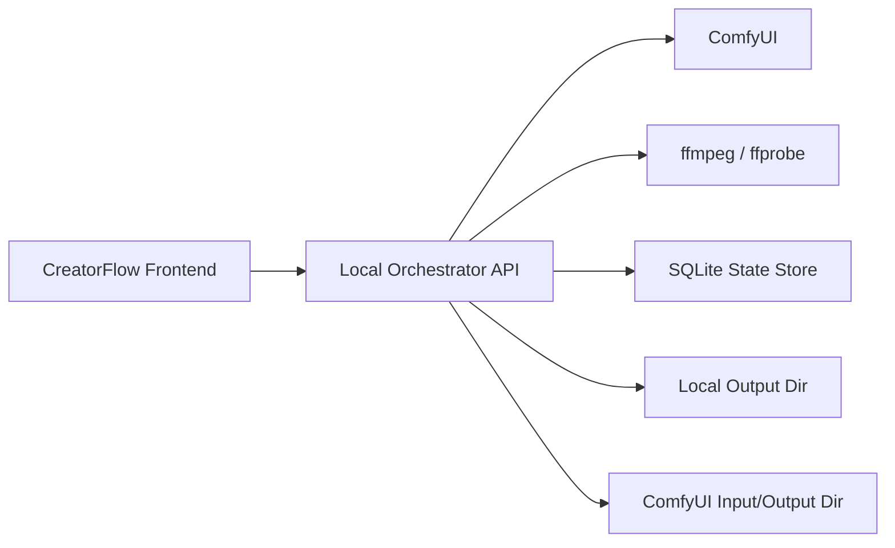

# 技术设计：数字人长音频分段批量生成

## 1. 设计结论

本方案不再把“分段队列、拼接落盘、清理”放在浏览器里完成，而是引入一个本地编排服务作为后台执行器。原因如下：

1. 浏览器不适合做稳定的本地落盘和定时清理。
2. 浏览器刷新后无法可靠承接长任务生命周期。
3. 前端 `ffmpeg.wasm` 对长视频拼接的内存压力过大。
4. 用户明确要求“后台批量生成”，这意味着任务生命周期必须脱离页面实例。

## 2. 目标架构

## 3. 组件职责

## 3.1 前端 CreatorFlow

职责：

- 收集任务配置
- 创建任务
- 查询任务列表和详情
- 订阅执行进度
- 展示监控、结果和错误
- 发出停止、重试、删除等控制指令

不负责：

- 直接编排分段执行
- 浏览器内拼接最终视频
- 浏览器内定时删除文件

## 3.2 本地编排服务

职责：

- 接收前端任务请求
- 保存任务与分段元数据
- 生成音频分段计划
- 顺序调用 ComfyUI 执行每个分段
- 提取尾帧并上传给 ComfyUI
- 调用 `ffmpeg` 完成拼接和清理
- 输出稳定的本地文件路径
- 支持状态恢复与失败重试

## 3.3 ComfyUI

职责：

- 负责单段数字人视频生成
- 输出每个分段的视频结果

不负责：

- 任务级分段逻辑
- 最终多段拼接
- 生命周期清理策略

## 4. 推荐技术选型

### 4.1 编排服务

- 语言：Python 3.11+
- Web 框架：FastAPI
- 状态存储：SQLite
- 媒体处理：本地 `ffmpeg` / `ffprobe`

选择原因：

1. Python 调用本地命令与文件系统简单。
2. `sqlite3` 为标准库，单机持久化成本低。
3. FastAPI 适合快速提供 REST + SSE/WebSocket。

## 5. 核心流程

## 5.1 任务创建流程

1. 前端上传图片和原始音频到编排服务。
2. 编排服务保存原始素材到工作目录。
3. 编排服务解析任务参数并创建 `job`。
4. 编排服务返回 `jobId`。
5. 前端调用“开始执行”或创建即入队。

## 5.2 分段执行流程

1. 读取原始音频并运行停顿点分析。
2. 生成 `segments[]`。
3. 对每一段执行以下步骤：
   - 导出分段音频
   - 上传参考图和音频到 ComfyUI
   - 构建工作流参数
   - 提交 prompt
   - 等待执行完成
   - 解析输出视频
   - 抽取尾帧
4. 全部段完成后执行拼接。
5. 保存最终视频。
6. 启动清理计划。

## 5.3 失败恢复流程

1. 某段失败后，任务状态变为 `failed`。
2. 已完成段保持 `completed`。
3. 用户触发“从失败段重试”。
4. 编排服务从最后一个成功段继续。
5. 若需要，复用已生成尾帧和已完成分段视频。

## 6. 状态模型

## 6.1 Job 状态

- `draft`
- `queued`
- `preparing`
- `running`
- `concatenating`
- `completed`
- `failed`
- `cancelled`
- `cleaning`
- `partially_cleaned`

## 6.2 Segment 状态

- `pending`
- `splitting`
- `uploading`
- `submitted`
- `running`
- `extracting_tail_frame`
- `completed`
- `failed`
- `skipped`

## 7. 数据模型

## 7.1 Job

建议字段：

- `id`
- `name`
- `status`
- `prompt`
- `seed`
- `fps`
- `max_resolution`
- `segment_mode`
- `max_segment_duration`
- `input_image_path`
- `input_audio_path`
- `output_dir`
- `final_video_path`
- `cleanup_policy`
- `cleanup_after_seconds`
- `created_at`
- `started_at`
- `completed_at`
- `last_error`

## 7.2 Segment

建议字段：

- `id`
- `job_id`
- `index`
- `status`
- `start_seconds`
- `end_seconds`
- `duration_seconds`
- `cut_reason`
- `source_image_mode`
- `source_image_path`
- `audio_segment_path`
- `comfy_prompt_id`
- `comfy_output_path`
- `tail_frame_path`
- `last_error`

## 7.3 Artifact

建议字段：

- `id`
- `job_id`
- `segment_id`
- `type`
- `path`
- `source`
- `created_at`
- `cleanup_status`

## 8. API 契约

## 8.1 REST

### `POST /api/jobs`

创建任务。

请求体建议包含：

- 基本参数
- 图片文件
- 音频文件
- 清理策略

返回：

- `jobId`
- `status`

### `GET /api/jobs`

返回任务列表摘要。

### `GET /api/jobs/{jobId}`

返回任务详情和分段详情。

### `POST /api/jobs/{jobId}/start`

启动任务。

### `POST /api/jobs/{jobId}/cancel`

取消任务。

### `POST /api/jobs/{jobId}/retry`

从失败段重试任务。

### `GET /api/jobs/{jobId}/artifacts`

返回最终结果和中间工件信息。

## 8.2 实时进度

建议提供：

- `GET /api/jobs/stream`
  SSE 推送任务状态

或：

- `WS /ws/jobs`
  WebSocket 推送任务和分段事件

事件至少包含：

- `job.created`
- `job.started`
- `job.updated`
- `segment.started`
- `segment.progress`
- `segment.completed`
- `segment.failed`
- `job.concatenating`
- `job.completed`
- `job.cleanup_scheduled`
- `job.cleanup_completed`

## 9. ComfyUI 对接策略

## 9.1 保留工作流模板

继续沿用当前 `ltx23-digital-human-api.json`，但由编排服务做参数替换。

## 9.2 参数注入

每段执行时至少替换：

- 图片输入
- 音频输入
- 提示词
- 种子
- 时长
- 帧率
- 分辨率
- 输出前缀

## 9.3 工作流时长校准

由于当前工作流内部存在“秒数转帧数”和 `TrimAudioDuration` 逻辑，因此不能简单把 `ceil(audioDuration)` 当成唯一规则。编排服务必须在开发期完成一轮时长校准，确认：

- 单段 `duration` 的传参规则
- 输出视频与音频的对齐策略
- `trim_to_audio` 是否需要开启

## 10. 音频切分策略

## 10.1 默认策略

1. 用 `ffprobe` 获取总时长。
2. 用 `ffmpeg silencedetect` 检测停顿点。
3. 以“尽量贴近最大时长但不超上限”为原则切分。
4. 无可用停顿点时强制切分。

## 10.2 切分输出

每个分段输出：

- 一个本地音频文件
- 一条 Segment 元数据

## 11. 尾帧连续性策略

1. 首段使用原始参考图。
2. 后续段从上一段视频中抽取尾帧。
3. 抽取方式使用 `ffmpeg`，默认取最后一帧附近的稳定帧。
4. 尾帧图片作为下一段的输入参考图上传到 ComfyUI。

默认策略：

- 提示词保持不变
- 使用固定基础种子
- 是否偏移种子作为可配置策略，不作为用户默认选项

## 12. 拼接与落盘

1. 所有分段视频完成后，由本地 `ffmpeg concat` 执行拼接。
2. 最终视频写入用户配置的输出目录。
3. 最终结果写回任务记录。
4. 前端只展示本地文件信息和预览地址，不再持有最终 `Blob` 作为唯一结果。

## 13. 清理策略

## 13.1 默认清理对象

- 分段音频
- 尾帧图片
- 中间分段视频
- 上传到工作目录的临时文件

## 13.2 保留对象

- 原始输入图片
- 原始输入音频
- 最终输出视频
- 执行日志

## 13.3 清理规则

- 成功任务：按 `cleanup_after_seconds` 延迟清理
- 失败任务：默认不自动清理，便于排查
- 调试模式：不自动清理

## 14. 前端改造策略

## 14.1 新增设置

- 编排服务地址
- 最终输出目录
- ComfyUI 输出目录
- 清理延迟
- 调试模式

## 14.2 编辑器改造

新增：

- 分段模式
- 每段最大时长
- 最终输出目录
- 清理策略

移除或弱化：

- 直接以浏览器内存为结果载体的设计

## 14.3 监控面板改造

新增：

- 分段列表
- 当前分段详情
- 失败段位置
- 清理状态
- 最终文件路径

## 15. 兼容与迁移

建议分阶段迁移：

1. 保留现有直接调用 ComfyUI 的单段链路，作为回滚方案。
2. 新增编排服务模式，用于长音频任务。
3. 完成稳定后，再将默认执行模式切换到编排服务。

## 16. 设计完成定义

当以下条件全部满足时，可视为设计完成：

1. 任务生命周期脱离浏览器实例。
2. 长音频任务可稳定切段、执行、拼接、落盘。
3. 中间文件清理不再依赖用户手工进入目录删除。
4. 前端刷新后仍可恢复任务状态。
