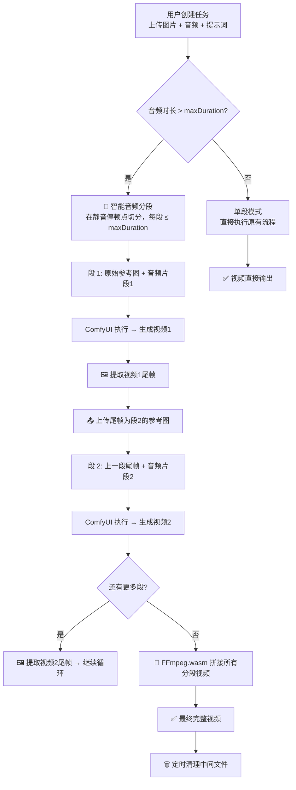

# CreatorFlow v2.0 — 音频分段 + 帧连续 + 自动拼接

> **核心升级**：长音频自动智能切分 → 分段队列执行（尾帧→首帧衔接）→ 自动拼接最终视频 → 中间文件定时清理

---

## 一、想法评估

### ✅ 可行性确认

| 能力 | 评估 | 说明 |
|------|------|------|
| 音频按停顿点切分 | ✅ 可行 | 前端使用 **Web Audio API** 解码音频为 PCM，检测静音段（低于阈值 RMS 持续 ≥ 200ms）作为切分点 |
| 分段 ≤ 10s 限制 | ✅ 可行 | 切分逻辑中加入`maxDuration`硬约束，超长段强制在最近的安静点二次切割 |
| 尾帧→首帧传递 | ✅ 可行 | ComfyUI 视频输出后通过 `/view` 获取视频文件 → 前端用 `<video>` + `<canvas>` 提取最后一帧 → 上传回 ComfyUI 作为下一段的参考图 |
| 视频拼接 | ✅ 可行 | 方案 A：前端使用 **FFmpeg.wasm**（推荐），直接在浏览器中无损拼接<br>方案 B：利用 ComfyUI 的 VHS 节点做后序拼接（依赖 ComfyUI） |
| 中间文件清理 | ✅ 可行 | 拼接完成后，通过记录的中间文件名列表，留存最终视频，中间分段文件在可配置的延迟后删除（ComfyUI 无直接删除 API，可标记不保存或在 output 目录手动清理） |

### ⚠️ 关键风险与应对

| 风险 | 影响 | 应对 |
|------|------|------|
| **尾帧提取质量** | 视频编码最后一帧可能有压缩失真 | 提取时 seek 到 `video.duration - 0.05` 位置，使用 canvas 导出高质量 JPEG（quality=0.95） |
| **视觉连续性断裂** | 相邻段之间画面可能有微小跳变 | 使用上一段尾帧作为首帧参考图 + 保持相同提示词 + 使用固定种子偏移。这已经是 LTX 2.3 Img2Video 的最佳实践 |
| **FFmpeg.wasm 体积** | ~25MB 首次加载 | 延迟加载（仅在拼接时才 import），加载过程显示进度条 |

---

## 二、整体流程架构

### 2.1 单任务完整生命周期



### 2.2 与现有架构的关系

```
现有流程: Task → 1次 ComfyUI 执行 → 1个视频输出
新流程:   Task → N个 Segment → N次 ComfyUI 执行 → N个中间视频 → 拼接 → 1个最终视频
```

**核心变化**：在 `Task` 和 `ComfyUI 执行` 之间插入了一个 **Segment（分段）层**。一个 Task 包含 1~N 个 Segment，每个 Segment 是一次独立的 ComfyUI 执行。

---

## 三、数据模型升级

### 3.1 Task 模型变更

```javascript
// task-schema.js 新增/修改的字段
const Task = {
  // ...原有字段保持不变...
  
  // ── 新增：分段相关 ──
  segmentMode: 'auto',        // 'auto' | 'manual' | 'single'
                               // auto: 自动检测是否需要分段
                               // single: 强制单段（不切分）
  maxSegmentDuration: 8,       // 每段最大秒数（默认 8，硬上限 10）
  
  segments: [],                // Segment[] — 分段列表（执行时动态填充）
  
  // ── 新增：最终输出 ──
  finalOutput: {              // 拼接后的最终视频
    videoUrl: null,
    filename: null,
    blob: null,               // FFmpeg.wasm 输出的 Blob
    duration: null,
  },
  
  // ── 修改：output 变为"当前段输出"或"单段模式直出" ──
  // output: { ... }          // 保持兼容，单段模式仍用此字段
};
```

### 3.2 新增 Segment 模型

```javascript
const Segment = {
  id: 'seg_001',              // 分段唯一 ID
  index: 0,                   // 在任务中的序号（从 0 开始）
  taskId: 'task_001',         // 所属任务 ID
  
  // ── 输入 ──
  imageSource: 'original',    // 'original' = 用户上传的参考图 | 'previous_tail' = 上一段尾帧
  imageName: null,            // 实际使用的图片文件名（已上传到 ComfyUI）
  audioName: null,            // 音频片段文件名（已上传到 ComfyUI）
  audioBlob: null,            // 切分后的音频 Blob（内存暂存）
  audioDuration: 0,           // 本段音频时长（秒）
  audioStartTime: 0,          // 在原始音频中的起始时间
  audioEndTime: 0,            // 在原始音频中的结束时间
  prompt: '',                 // 继承自 Task（可后续支持每段独立）
  seed: 42,                   // 种子（可选：每段自动递增）
  duration: 6,                // ComfyUI 生成时长参数（= ceil(audioDuration)）
  
  // ── 执行状态 ──
  status: 'pending',          // pending | uploading | running | completed | failed
  promptId: null,
  progress: 0,
  progressLabel: '',
  currentNode: null,
  error: null,
  
  // ── 输出 ──
  output: {
    filename: null,
    subfolder: null,
    type: null,
    videoUrl: null,
  },
  tailFrameUrl: null,          // 本段尾帧图片 URL（用于传给下一段）
  tailFrameUploadedName: null, // 尾帧上传到 ComfyUI 后的文件名
};
```

---

## 四、核心模块设计

### 4.1 音频分段引擎 — `audio-splitter.js`（新增）

```
位置: core/audio-splitter.js
职责: 将一段音频按静音停顿点切分为多个片段，每段不超过 maxDuration
```

#### 核心算法

```javascript
export class AudioSplitter {
  /**
   * 分析音频并返回切分点列表
   * @param {File|Blob} audioFile
   * @param {object} options
   * @param {number} options.maxDuration - 每段最大秒数（默认 8）
   * @param {number} options.silenceThreshold - 静音阈值 RMS（默认 0.01）
   * @param {number} options.minSilenceDuration - 最短静音持续时间（秒，默认 0.2）
   * @param {number} options.minSegmentDuration - 最短分段时长（秒，默认 2）
   * @returns {Promise<SplitPlan>}
   */
  async analyze(audioFile, options = {}) { ... }

  /**
   * 按切分计划将音频切为多个 Blob
   * @param {AudioBuffer} audioBuffer
   * @param {SplitPoint[]} splitPoints
   * @returns {AudioSegment[]}
   */
  split(audioBuffer, splitPoints) { ... }
}

// 返回类型
type SplitPlan = {
  totalDuration: number;        // 原始音频总时长
  needsSplit: boolean;          // 是否需要切分
  segments: AudioSegment[];     // 切分结果
};

type AudioSegment = {
  index: number;
  startTime: number;            // 秒
  endTime: number;              // 秒
  duration: number;             // 秒
  blob: Blob;                   // WAV 格式音频片段
  filename: string;             // 建议文件名
};
```

#### 静音检测算法

```javascript
/**
 * 扫描 AudioBuffer，找出所有静音区间
 * 
 * 1. 将音频按 windowSize（如 2048 samples）分帧
 * 2. 每帧计算 RMS（均方根能量）
 * 3. RMS < threshold 的连续帧标记为"静音"
 * 4. 静音持续 >= minSilenceDuration 的区间作为候选切分点
 * 5. 在候选切分点中挑选，使得每段 <= maxDuration
 * 6. 如果某段内没有候选点但超时了，在 maxDuration 处强制切分
 */
function detectSilences(audioBuffer, threshold, minSilenceDuration) {
  const data = audioBuffer.getChannelData(0); // 单声道或取第一声道
  const sampleRate = audioBuffer.sampleRate;
  const windowSize = 2048;
  const silences = [];
  
  let silenceStart = null;
  
  for (let i = 0; i < data.length; i += windowSize) {
    const end = Math.min(i + windowSize, data.length);
    let sumSq = 0;
    for (let j = i; j < end; j++) {
      sumSq += data[j] * data[j];
    }
    const rms = Math.sqrt(sumSq / (end - i));
    const timePos = i / sampleRate;
    
    if (rms < threshold) {
      if (silenceStart === null) silenceStart = timePos;
    } else {
      if (silenceStart !== null) {
        const silenceDuration = timePos - silenceStart;
        if (silenceDuration >= minSilenceDuration) {
          // 切分点取静音段的中间位置
          silences.push({
            start: silenceStart,
            end: timePos,
            midpoint: silenceStart + silenceDuration / 2,
            duration: silenceDuration,
          });
        }
        silenceStart = null;
      }
    }
  }
  
  return silences;
}
```

#### 贪心分段策略

```javascript
/**
 * 从候选静音切分点中选择实际切分位置
 * 贪心策略：从头扫描，尽可能让每段接近但不超过 maxDuration
 */
function selectSplitPoints(silences, totalDuration, maxDuration, minSegmentDuration) {
  const points = [0]; // 起始点
  let lastCut = 0;
  
  for (const silence of silences) {
    const segmentLength = silence.midpoint - lastCut;
    
    if (segmentLength >= maxDuration) {
      // 超过上限，在这个静音点切
      points.push(silence.midpoint);
      lastCut = silence.midpoint;
    } else if (segmentLength >= maxDuration * 0.7) {
      // 接近上限（>70%），在此切较好
      points.push(silence.midpoint);
      lastCut = silence.midpoint;
    }
    // 否则继续累积
  }
  
  points.push(totalDuration); // 结束点
  
  // 后处理：检查是否有超长段（无静音点可切的区域）
  return enforceMaxDuration(points, maxDuration);
}
```

### 4.2 视频帧提取 — `frame-extractor.js`（新增）

```
位置: core/frame-extractor.js
职责: 从视频 URL 提取指定帧（尾帧）为图片
```

```javascript
export class FrameExtractor {
  /**
   * 从视频 URL 提取尾帧
   * @param {string} videoUrl - 视频文件 URL
   * @param {object} options
   * @param {number} options.quality - JPEG 质量 0-1（默认 0.95）
   * @param {string} options.format - 'image/jpeg' | 'image/png'
   * @returns {Promise<{ blob: Blob, width: number, height: number }>}
   */
  async extractTailFrame(videoUrl, options = {}) {
    const { quality = 0.95, format = 'image/jpeg' } = options;
    
    return new Promise((resolve, reject) => {
      const video = document.createElement('video');
      video.crossOrigin = 'anonymous';
      video.preload = 'auto';
      video.muted = true;
      
      video.onloadedmetadata = () => {
        // Seek到接近末尾位置（倒退 0.05s 避免边界问题）
        video.currentTime = Math.max(0, video.duration - 0.05);
      };
      
      video.onseeked = () => {
        const canvas = document.createElement('canvas');
        canvas.width = video.videoWidth;
        canvas.height = video.videoHeight;
        const ctx = canvas.getContext('2d');
        ctx.drawImage(video, 0, 0);
        
        canvas.toBlob((blob) => {
          resolve({
            blob,
            width: video.videoWidth,
            height: video.videoHeight,
          });
          // 清理
          video.src = '';
          video.load();
        }, format, quality);
      };
      
      video.onerror = () => reject(new Error('Failed to load video'));
      
      // 超时保护
      setTimeout(() => reject(new Error('Frame extraction timeout')), 30000);
      
      video.src = videoUrl;
    });
  }
}
```

### 4.3 视频拼接 — `video-concatenator.js`（新增）

```
位置: core/video-concatenator.js
职责: 使用 FFmpeg.wasm 将多个视频片段拼接为一个完整视频
```

```javascript
export class VideoConcatenator {
  #ffmpeg = null;
  #loaded = false;
  
  /**
   * 延迟加载 FFmpeg.wasm
   * @param {Function} onProgress - 加载进度回调
   */
  async load(onProgress) {
    if (this.#loaded) return;
    // 动态 import FFmpeg.wasm（仅在首次拼接时加载）
    const { FFmpeg } = await import(
      'https://cdn.jsdelivr.net/npm/@ffmpeg/ffmpeg@0.12.10/+esm'
    );
    const { toBlobURL } = await import(
      'https://cdn.jsdelivr.net/npm/@ffmpeg/util@0.12.1/+esm'
    );
    
    this.#ffmpeg = new FFmpeg();
    this.#ffmpeg.on('progress', ({ progress }) => {
      onProgress?.(progress);
    });
    
    await this.#ffmpeg.load({
      coreURL: await toBlobURL(
        'https://cdn.jsdelivr.net/npm/@ffmpeg/core@0.12.6/dist/esm/ffmpeg-core.js',
        'text/javascript'
      ),
      wasmURL: await toBlobURL(
        'https://cdn.jsdelivr.net/npm/@ffmpeg/core@0.12.6/dist/esm/ffmpeg-core.wasm',
        'application/wasm'
      ),
    });
    
    this.#loaded = true;
  }
  
  /**
   * 拼接多个视频片段
   * @param {Array<{ url: string, filename: string }>} segments - 视频片段（按顺序）
   * @param {object} options
   * @param {Function} options.onProgress - 拼接进度回调
   * @returns {Promise<Blob>} 拼接后的 MP4 视频
   */
  async concatenate(segments, options = {}) {
    await this.load(options.onProgress);
    
    const ffmpeg = this.#ffmpeg;
    
    // 1. 下载所有分段视频到 FFmpeg 虚拟文件系统
    for (let i = 0; i < segments.length; i++) {
      const resp = await fetch(segments[i].url);
      const data = new Uint8Array(await resp.arrayBuffer());
      const name = `segment_${i}.mp4`;
      await ffmpeg.writeFile(name, data);
    }
    
    // 2. 创建拼接列表文件
    const concatList = segments
      .map((_, i) => `file 'segment_${i}.mp4'`)
      .join('\n');
    await ffmpeg.writeFile('concat.txt', concatList);
    
    // 3. 执行无损拼接
    await ffmpeg.exec([
      '-f', 'concat',
      '-safe', '0',
      '-i', 'concat.txt',
      '-c', 'copy',          // 无损复制（不重新编码）
      '-movflags', '+faststart',
      'output.mp4'
    ]);
    
    // 4. 读取结果
    const outputData = await ffmpeg.readFile('output.mp4');
    const blob = new Blob([outputData.buffer], { type: 'video/mp4' });
    
    // 5. 清理虚拟文件系统
    for (let i = 0; i < segments.length; i++) {
      await ffmpeg.deleteFile(`segment_${i}.mp4`);
    }
    await ffmpeg.deleteFile('concat.txt');
    await ffmpeg.deleteFile('output.mp4');
    
    return blob;
  }
}
```

> **注意**：FFmpeg `-c copy` 无损拼接要求所有分段视频的编码格式、分辨率、帧率一致。因为所有分段都由同一个 ComfyUI 工作流以相同参数生成，这个条件天然满足。

### 4.4 中间文件管理 — `cleanup-manager.js`（新增）

```
位置: core/cleanup-manager.js
职责: 记录中间文件，拼接完成后标记可清理
```

```javascript
export class CleanupManager {
  #pendingCleanup = new Map(); // taskId → { filenames[], scheduledAt }
  #cleanupDelay;  // 清理延迟（毫秒）
  
  constructor({ cleanupDelay = 5 * 60 * 1000 } = {}) {
    this.#cleanupDelay = cleanupDelay; // 默认 5 分钟后清理
  }
  
  /**
   * 注册中间文件以备后续清理
   * @param {string} taskId
   * @param {string[]} filenames - 中间视频/图片文件名
   */
  registerIntermediateFiles(taskId, filenames) {
    this.#pendingCleanup.set(taskId, {
      filenames,
      registeredAt: Date.now(),
    });
  }
  
  /**
   * 拼接完成后，调度定时清理
   * 由于 ComfyUI 没有直接的文件删除 API，
   * 这里记录待清理文件列表供用户手动或通过脚本清理
   * @param {string} taskId
   */
  scheduleCleanup(taskId) {
    const entry = this.#pendingCleanup.get(taskId);
    if (!entry) return;
    
    entry.scheduledAt = Date.now();
    console.log(
      `[Cleanup] Scheduled cleanup for task ${taskId} in ${this.#cleanupDelay / 1000}s:`,
      entry.filenames
    );
    
    // 注意：ComfyUI 无原生删除 API，两种策略：
    // 策略A：在前端 UI 提供"清理中间文件"按钮，列出待清理文件
    // 策略B：如果 ComfyUI 部署在本机，通过自定义 API 节点删除
    // MVP 先走策略 A
  }
  
  /**
   * 获取所有待清理的记录
   */
  getPendingCleanups() {
    return Array.from(this.#pendingCleanup.entries());
  }
}
```

---

## 五、TaskQueue 重构

### 5.1 分段执行流程

现有 `#executeTask(task)` 需要重构为支持分段模式：

```javascript
async #executeTask(task) {
  // Step 1: 音频分析 + 分段
  const segments = await this.#prepareSegments(task);
  task.segments = segments;
  
  if (segments.length === 1) {
    // 单段模式：走原有流程
    await this.#executeSingleSegment(task, segments[0]);
  } else {
    // 多段模式：逐段执行 + 尾帧传递
    await this.#executeMultiSegment(task, segments);
  }
}

async #prepareSegments(task) {
  const splitter = new AudioSplitter();
  
  // 获取音频文件（从 ComfyUI /view 端点或本地缓存）
  const audioUrl = this.#client.getViewUrl({
    filename: task.audio.uploadedName,
    type: 'input',
  });
  
  const audioResp = await fetch(audioUrl);
  const audioBlob = await audioResp.blob();
  
  const plan = await splitter.analyze(audioBlob, {
    maxDuration: task.maxSegmentDuration || 8,
  });
  
  if (!plan.needsSplit) {
    // 不需要切分，单段执行
    return [createSegment(task, 0, {
      audioName: task.audio.uploadedName,
      imageName: task.image.uploadedName,
      imageSource: 'original',
      audioDuration: plan.totalDuration,
      audioStartTime: 0,
      audioEndTime: plan.totalDuration,
      duration: Math.min(Math.ceil(plan.totalDuration), 10),
    })];
  }
  
  // 为每个音频片段创建 Segment
  return plan.segments.map((seg, i) => createSegment(task, i, {
    audioBlob: seg.blob,
    audioDuration: seg.duration,
    audioStartTime: seg.startTime,
    audioEndTime: seg.endTime,
    imageName: i === 0 ? task.image.uploadedName : null, // 第一段用原图，后续用尾帧
    imageSource: i === 0 ? 'original' : 'previous_tail',
    duration: Math.min(Math.ceil(seg.duration), 10),
    seed: task.seed + i, // 种子递增，保证多样性但可复现
  }));
}

async #executeMultiSegment(task, segments) {
  task.status = 'running';
  task.startedAt = new Date().toISOString();
  
  const completedOutputs = []; // 收集所有分段输出
  const intermediateFiles = []; // 记录中间文件
  
  for (let i = 0; i < segments.length; i++) {
    const seg = segments[i];
    
    // 进度更新
    task.progress = Math.round((i / segments.length) * 100);
    task.progressLabel = `分段 ${i + 1}/${segments.length}`;
    this.#emit('queue:task-progress', { taskId: task.id, segmentIndex: i });
    
    // ── 1. 上传音频片段 ──
    if (seg.audioBlob) {
      seg.status = 'uploading';
      const audioFile = new File(
        [seg.audioBlob],
        `${task.id}_seg${i}_audio.wav`,
        { type: 'audio/wav' }
      );
      const uploadResult = await this.#uploader.uploadAsset(audioFile, { kind: 'audio' });
      seg.audioName = uploadResult.name;
      intermediateFiles.push(uploadResult.name);
    }
    
    // ── 2. 首帧处理（第 2 段起） ──
    if (i > 0) {
      const prevSeg = segments[i - 1];
      // 从上一段视频提取尾帧
      const tailFrame = await this.#frameExtractor.extractTailFrame(
        prevSeg.output.videoUrl
      );
      // 上传尾帧作为本段参考图
      const frameFile = new File(
        [tailFrame.blob],
        `${task.id}_seg${i}_tailframe.jpg`,
        { type: 'image/jpeg' }
      );
      const frameUpload = await this.#uploader.uploadAsset(frameFile, { kind: 'image' });
      seg.imageName = frameUpload.name;
      seg.tailFrameUploadedName = frameUpload.name;
      intermediateFiles.push(frameUpload.name);
    }
    
    // ── 3. 构建工作流并提交 ──
    seg.status = 'running';
    const workflow = buildSegmentWorkflow(this.#template, task, seg);
    const result = await this.#client.submitPrompt(workflow);
    seg.promptId = result.prompt_id;
    this.#promptTaskMap.set(result.prompt_id, task.id);
    
    // ── 4. 等待完成 ──
    const outcome = await this.#waitForCompletion(result.prompt_id, task);
    if (outcome.error) {
      seg.status = 'failed';
      seg.error = outcome.error;
      throw new Error(`分段 ${i + 1} 执行失败: ${outcome.error}`);
    }
    
    // ── 5. 提取结果 ──
    const history = await this.#client.getHistory(result.prompt_id);
    const extracted = extractResult(history, result.prompt_id, (p) =>
      this.#client.getViewUrl(p)
    );
    
    if (!extracted.success) {
      seg.status = 'failed';
      throw new Error(`分段 ${i + 1} 结果提取失败`);
    }
    
    seg.output = {
      filename: extracted.filename,
      subfolder: extracted.subfolder,
      type: extracted.type,
      videoUrl: extracted.videoUrl,
    };
    seg.status = 'completed';
    intermediateFiles.push(extracted.filename);
    completedOutputs.push(seg.output);
  }
  
  // ── 6. 拼接所有分段 ──
  task.progressLabel = '正在拼接视频...';
  this.#emit('queue:task-progress', { taskId: task.id });
  
  const concatenator = new VideoConcatenator();
  const finalBlob = await concatenator.concatenate(
    completedOutputs.map(o => ({
      url: o.videoUrl,
      filename: o.filename,
    })),
    {
      onProgress: (p) => {
        task.progress = 90 + Math.round(p * 10);
        task.progressLabel = `拼接中 ${Math.round(p * 100)}%`;
      },
    }
  );
  
  // ── 7. 保存最终视频 ──
  task.finalOutput = {
    blob: finalBlob,
    filename: `creatorflow-${task.id}-final.mp4`,
    videoUrl: URL.createObjectURL(finalBlob),
    duration: segments.reduce((sum, s) => sum + s.audioDuration, 0),
  };
  
  task.status = 'completed';
  task.completedAt = new Date().toISOString();
  task.progress = 100;
  task.progressLabel = '完成';
  
  // ── 8. 注册中间文件清理 ──
  this.#cleanupManager.registerIntermediateFiles(task.id, intermediateFiles);
  this.#cleanupManager.scheduleCleanup(task.id);
}
```

### 5.2 工作流模板改造 — `buildSegmentWorkflow`

```javascript
// workflow-template.js 新增函数

/**
 * 为单个 Segment 构建工作流
 * 与 buildWorkflow 的区别：
 * 1. 图片来源可能是尾帧而非原始参考图
 * 2. 音频是切分后的片段
 * 3. 生成时长匹配音频片段时长
 * 4. 输出前缀包含分段序号
 */
export function buildSegmentWorkflow(template, task, segment) {
  const wf = structuredClone(template);
  
  // 图片：可能是原始图或上一段尾帧
  wf[NODE_MAP.IMAGE.nodeId].inputs[NODE_MAP.IMAGE.field] = segment.imageName;
  
  // 音频：分段后的片段
  wf[NODE_MAP.AUDIO.nodeId].inputs[NODE_MAP.AUDIO.field] = segment.audioName;
  
  // 提示词：继承自 Task
  wf[NODE_MAP.PROMPT.nodeId].inputs[NODE_MAP.PROMPT.field] = task.prompt;
  
  // 种子：每段递增
  wf[NODE_MAP.SEED.nodeId].inputs[NODE_MAP.SEED.field] = segment.seed;
  
  // 时长：匹配音频片段
  wf[NODE_MAP.DURATION.nodeId].inputs[NODE_MAP.DURATION.field] = segment.duration;
  
  // 帧率 + 分辨率：继承
  wf[NODE_MAP.FPS.nodeId].inputs[NODE_MAP.FPS.field] = task.fps;
  wf[NODE_MAP.MAX_RESOLUTION.nodeId].inputs[NODE_MAP.MAX_RESOLUTION.field] = task.maxResolution;
  
  // 输出前缀：包含分段信息
  wf[NODE_MAP.OUTPUT_PREFIX.nodeId].inputs[NODE_MAP.OUTPUT_PREFIX.field] =
    `creatorflow-dh-${task.id}-seg${segment.index}-${Date.now()}`;
  
  return wf;
}
```

---

## 六、UI 更新

### 6.1 任务编辑器变更

在高级参数区域新增：

```
⚙️ 高级设置
├── 随机种子: [42] 🎲
├── 帧率: [30]
├── 最大分辨率: [1280 ▾]
└── ── 分段设置 ── (新增)
    ├── 分段模式: [自动 ▾]  (自动 / 强制单段)
    ├── 每段最大时长: [8] 秒  (滑条, 2-10)
    └── 音频预分析: [分析] → 显示预计分段数
```

### 6.2 执行监控面板变更

多段模式时，监控面板显示：

```
┌──────────────────────────────────────────────────────┐
│  🎬 任务: 美女唱歌                                     │
│  📊 整体进度: ██████████░░░░░░ 65% (分段 2/3)          │
│                                                      │
│  分段详情:                                             │
│  ├── 段 1 (0:00-0:08) ████████████████ 100% ✅        │
│  ├── 段 2 (0:08-0:16) ████████░░░░░░░  50% 🔄        │
│  └── 段 3 (0:16-0:22) ░░░░░░░░░░░░░░░   0% ⏳        │
│                                                      │
│  当前: 段 2 - 采样中 4/8                               │
│  当前节点: SamplerCustomAdvanced                       │
└──────────────────────────────────────────────────────┘
```

### 6.3 结果预览变更

拼接完成后的预览：

```
┌──────────────────────────────────────────────────────┐
│  🎬 最终视频                                           │
│  ┌──────────────────────────────────────────┐        │
│  │           <video player>                  │        │
│  │         拼接视频 (22 秒, 3 段)             │        │
│  └──────────────────────────────────────────┘        │
│  [💾 下载最终视频]  [📂 查看分段]  [🗑 清理中间文件]     │
│                                                      │
│  ▶ 分段视频列表 (可展开)                                │
│  ├── seg_1.mp4 (8s) [▶ 播放] [💾 下载]                 │
│  ├── seg_2.mp4 (8s) [▶ 播放] [💾 下载]                 │
│  └── seg_3.mp4 (6s) [▶ 播放] [💾 下载]                 │
└──────────────────────────────────────────────────────┘
```

---

## 七、文件变更矩阵

| 文件 | 变更类型 | 主要变更内容 |
|------|----------|-------------|
| `core/audio-splitter.js` | **新增** | 音频分析、静音检测、智能切分 |
| `core/frame-extractor.js` | **新增** | 视频尾帧提取 |
| `core/video-concatenator.js` | **新增** | FFmpeg.wasm 视频拼接 |
| `core/cleanup-manager.js` | **新增** | 中间文件管理与清理 |
| `core/task-queue.js` | **重构** | 新增分段执行流程、尾帧传递、拼接调度 |
| `modules/digital-human/task-schema.js` | **修改** | 新增 Segment 模型、Task 分段字段 |
| `modules/digital-human/workflow-template.js` | **修改** | 新增 `buildSegmentWorkflow()` |
| `modules/digital-human/task-editor.js` | **修改** | 新增分段设置 UI、音频预分析按钮 |
| `modules/digital-human/execution-monitor.js` | **修改** | 分段进度显示、分段列表视图 |
| `modules/digital-human/digital-human.js` | **修改** | 适配分段任务状态、结果预览升级 |
| `modules/digital-human/digital-human.css` | **修改** | 分段 UI 样式 |

---

## 八、分阶段实现计划

### Phase 1：音频分段引擎（核心底层）

| 步骤 | 内容 |
|------|------|
| 1.1 | 创建 `audio-splitter.js` — Web Audio API 解码 + RMS 静音检测 |
| 1.2 | 实现贪心分段策略 + 强制切分后备 |
| 1.3 | 实现 WAV 导出（AudioBuffer → Blob） |
| 1.4 | 单元测试：用不同长度音频验证切分结果 |

**验收**：在 console 中调用 `AudioSplitter.analyze(audioFile)` 能正确返回切分计划

### Phase 2：帧提取 + 视频拼接

| 步骤 | 内容 |
|------|------|
| 2.1 | 创建 `frame-extractor.js` — video + canvas 尾帧提取 |
| 2.2 | 创建 `video-concatenator.js` — FFmpeg.wasm 延迟加载 + concat |
| 2.3 | 创建 `cleanup-manager.js` — 中间文件记录 |

**验收**：手动给两个视频 URL，能提取尾帧、成功拼接为单个视频

### Phase 3：TaskQueue + 工作流改造

| 步骤 | 内容 |
|------|------|
| 3.1 | 扩展 Task 数据模型（新增分段字段） |
| 3.2 | 新增 `buildSegmentWorkflow()` |
| 3.3 | 重构 `TaskQueue.#executeTask()` → 分段分支 |
| 3.4 | 实现 `#executeMultiSegment()` 完整流程 |
| 3.5 | 适配 WebSocket 进度上报（segment 级别） |

**验收**：提交一个 25 秒音频的任务，自动切为 3 段 → 逐段执行 → 拼接 → 获得完整视频

### Phase 4：UI 层适配

| 步骤 | 内容 |
|------|------|
| 4.1 | 任务编辑器新增分段设置区域 |
| 4.2 | 执行监控面板适配分段显示 |
| 4.3 | 结果预览升级（最终视频 + 分段列表） |
| 4.4 | "清理中间文件"按钮 |
| 4.5 | 音频预分析：可视化显示切分预览 |

**验收**：完整 UI 流程可操作，分段进度实时显示

### Phase 5：测试 & 打磨

| 步骤 | 内容 |
|------|------|
| 5.1 | 测试短音频（< maxDuration）走单段模式 |
| 5.2 | 测试长音频多段执行 + 拼接 |
| 5.3 | 测试断线恢复 / 某段失败后重试 |
| 5.4 | 测试连续多任务（任务 A 多段 → 任务 B 多段） |
| 5.5 | 优化拼接性能和内存占用 |

---

## 九、开放问题

> [!IMPORTANT]
> 以下问题需要你确认，会影响实现细节

### Q1：每段最大时长默认值？
你说不能超过 10s。建议默认设为 **8 秒**（留 2s 余量给模型处理），可以吗？

### Q2：分段间视觉连续性强化
除了尾帧→首帧，是否需要额外处理？例如：
- 每段使用相同种子（vs 递增种子）
- 每段提示词完全相同（vs 允许微调）

### Q3：拼接后的最终视频如何保存？
- **方案 A**：前端 Blob → 浏览器下载（用户手动保存位置）
- **方案 B**：上传回 ComfyUI output 目录（需要 ComfyUI 支持）
- **推荐 A + 自动触发下载**

### Q4：中间文件清理策略
ComfyUI 没有原生文件删除 API，你更倾向：
- **策略 A**：在 UI 提供清理按钮 + 文件列表，用户自行去 ComfyUI output 目录删除
- **策略 B**：写一个简单 Python 脚本通过 ComfyUI custom node 实现删除
- **策略 C**：完全不管中间文件（让用户定期手动清理 output 目录）
